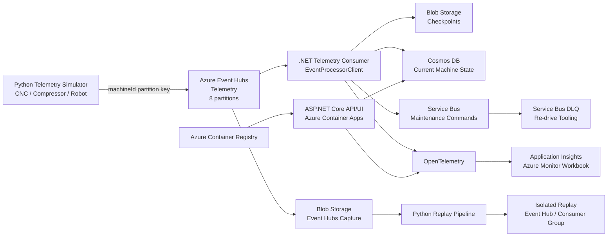

# IndustriePulse Architecture

IndustriePulse is an event-driven industrial telemetry platform designed around Azure messaging, durable stream processing, current-state projection, maintenance workflows, replay, observability, and production-reference security.

## System context

The modeled manufacturing estate contains five sites and 5,000 machines. At one event per machine every five seconds, the nominal workload is approximately 1,000 telemetry events per second.

## Processing semantics

- Telemetry is partitioned by `machineId`, preserving per-machine ordering within an Event Hubs partition.
- The .NET consumer uses `EventProcessorClient` with Blob-backed ownership and checkpoints.
- Processing occurs before checkpoint advancement.
- Machine state advances only when telemetry sequence numbers are newer than the stored projection.
- Duplicate and stale telemetry therefore cannot regress current state.
- Maintenance rules execute only when the current-state projection advances.
- Maintenance command IDs are deterministic, supporting idempotent handling.
- Poison Service Bus messages are isolated in the DLQ and can be explicitly inspected and re-driven.
- Event Hubs Capture provides a durable cold copy that can be replayed into an isolated replay path.

## Data paths

### Live telemetry

`Simulator -> Event Hubs -> Consumer -> Cosmos DB -> API`

### Maintenance commands

`Consumer -> Rule Engine -> Service Bus -> downstream maintenance processing`

### Failure recovery

`Service Bus -> DLQ -> re-drive CLI -> Service Bus`

### Historical replay

`Event Hubs Capture -> Blob Storage -> replay job -> isolated replay Event Hub`

### Observability

`Consumer/OpenTelemetry -> Application Insights -> Azure Monitor Workbook`

## Failure model

The system deliberately assumes at-least-once delivery rather than exactly-once processing.

Correctness therefore depends on:

- deterministic event and command identifiers;
- monotonic machine-state sequence handling;
- processing-before-checkpoint semantics;
- Service Bus duplicate detection;
- explicit poison-message isolation;
- replay isolation from the live consumer path.

A remaining production consideration is that Cosmos DB state advancement and Service Bus command publication are not atomic. ADR-007 documents a transactional outbox as a future hardening option.

## Scaling model

The baseline architecture models:

- 5 manufacturing sites;
- 5,000 machines;
- approximately 1,000 events/second nominal ingress;
- 2,000 events/second short-duration design peak;
- 8 Event Hubs partitions;
- independent consumer-group progress;
- measurable backpressure through processing lag and event age.

The 1,000 events/second figure is a workload sizing target, not a claim that the current single-process synchronous Python publisher achieved that rate against Azure.

## Development economics

Azure resources are intentionally short-lived for portfolio validation. Container Apps can scale to zero, development-tier services are used where appropriate, and infrastructure is destroyed after evidence is captured.

The project separates executed low-cost demonstrations from production sizing and security reference designs.

## Production-reference security

P11 defines a stronger production access model based on:

- Microsoft Entra workload identity;
- separate managed identities for API and consumer workloads;
- least-privilege Azure data-plane RBAC;
- VNet-integrated workloads;
- Private Link for core Event Hubs, Service Bus, Cosmos DB, and Blob data paths;
- private DNS;
- disabling local authentication and public data-plane access after workload migration.

This is a validated reference architecture. It is not presented as an executed end-to-end private production deployment.

See [ADR-014](adr/ADR-014-security-and-private-connectivity.md), the [threat model](security/threat-model.md), and the [access-path matrix](security/access-paths.md) for the production-reference security boundary.
